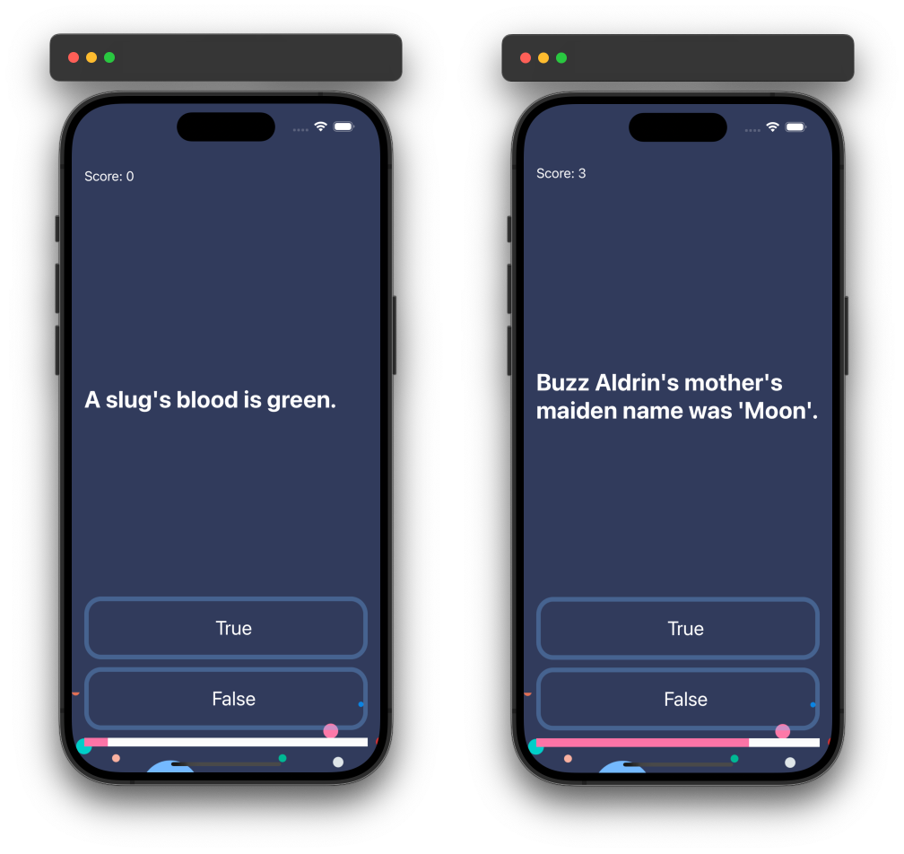

# Quizzler

## Introduction

Quizzler is an interactive iOS application that presents a series of true or false questions to the user. The app keeps track of the user's score and displays progress throughout the quiz, making it a fun and engaging way to test your knowledge on various topics.

### Preview

  

## Features

- **Interactive Questions:** Users can answer a series of true or false questions.
- **Visual Feedback:** Immediate visual feedback is provided for correct and incorrect answers.
- **Score Tracking:** The app keeps track of the user's score throughout the quiz.
- **Progress Indicator:** A progress bar shows the user's progress through the quiz.
- **Automatic Question Progression:** The app automatically moves to the next question after a brief delay.

## Code Structure

### ViewController

The main view controller manages the user interface and handles user interactions. It displays the current question, updates the progress bar and score label, and provides visual feedback for the user's answers.

### QuizBrain

The `QuizBrain` structure contains the core logic for the quiz. It manages the list of questions, tracks the user's score and current question, and provides methods to check answers and retrieve the current question and progress.

### Question

The `Question` structure represents a single quiz question, including the question text and the correct answer.

## Conclusion

Quizzler is a simple yet engaging iOS application that demonstrates basic interaction, state management, and UI updates. It provides a solid foundation for building more complex quiz-based applications and can be easily expanded with additional features and question sets. Enjoy testing your knowledge with Quizzler!

---

Feel free to customize this README further to match any additional features or details specific to your application.